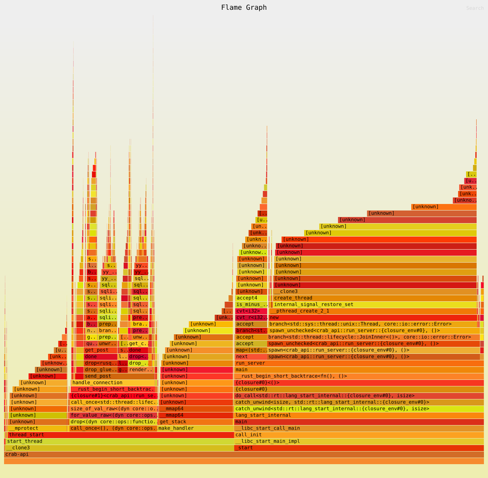
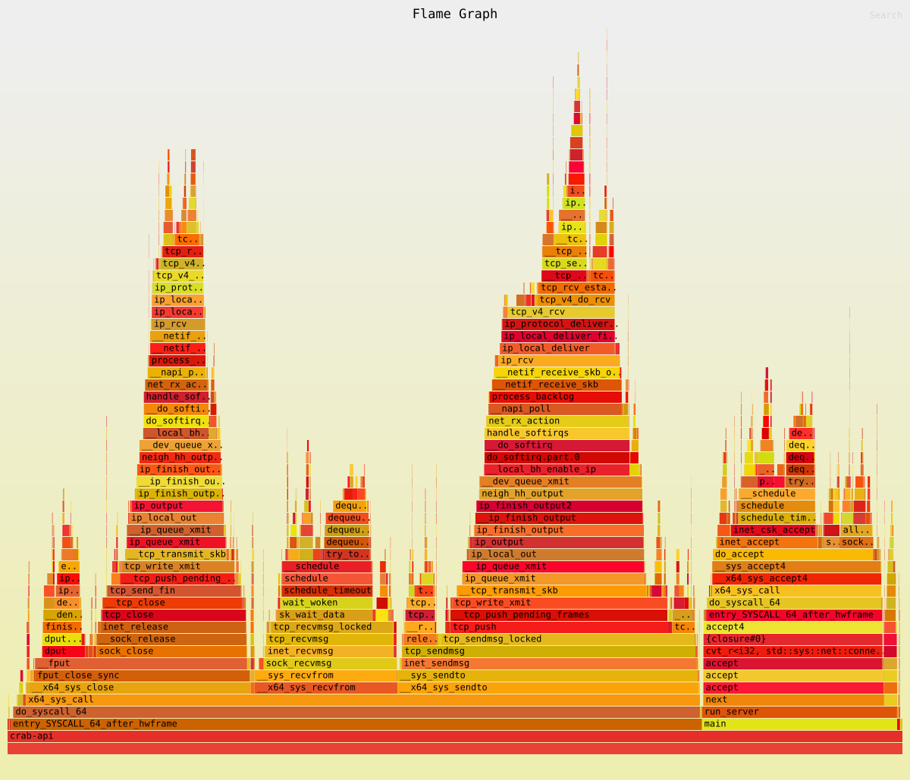

# Request time optimisation

## 27.09.2026

Did some testing in debug mode, and release mode. Removed all the debugging prints.

Tested on "/" get request, and on "/post/2" get request, not logged in, with 24 comments on the page.

Requests: 10k, Concurent connections: 1k

Stats (From benchmarks/speed.txt)

BEFORE:

With Prints to /: (Debug Mode)
Time: 21:02:10, Runs: 10, Speed (Seconds): 0.8531, Date: 2026-09-27
Time: 21:05:18, Runs: 10, Speed (Seconds): 0.8348, Date: 2026-09-27

Without Prints to /: (Debug Mode)
Time: 21:05:43, Runs: 10, Speed (Seconds): 0.8171, Date: 2026-09-27

Requests sent to /posts/2 (Post with 24 comments and no image) (Debug Mode)

Time: 21:07:16, Runs: 10, Speed (Seconds): 1.9910, Date: 2026-09-27

Time: 21:08:22, Runs: 10, Speed (Seconds): 1.9867, Date: 2026-09-27

Requests sent to /posts/2 (Post with 24 comments and no image) (Release Mode)

Time: 21:15:32, Runs: 10, Speed (Seconds): 1.0132, Date: 2026-09-27

Time: 21:15:55, Runs: 10, Speed (Seconds): 0.9995, Date: 2026-09-27

Time: 21:16:10, Runs: 10, Speed (Seconds): 0.9951, Date: 2026-09-27

Time: 21:16:25, Runs: 10, Speed (Seconds): 1.0038, Date: 2026-09-27

Flamegraph:

Conclusion: Implement thread pooling

So thats what I did, we have a pool of worker threads now all communicating through a cloned channel, wrapped by a mutex, to act as the queue for the jobs.

It turns out, currently, on my CPU (24 threads), the server runs best on two threads (As per speed.txt):

Tuning for best thread count (For current setup):
4 Threads:
Time: 00:22:41, Runs: 10, Speed (Seconds): 0.7721, Date: 2026-09-28
Time: 00:22:59, Runs: 10, Speed (Seconds): 0.7700, Date: 2026-09-28

8 threads:
Time: 00:23:38, Runs: 10, Speed (Seconds): 0.8358, Date: 2026-09-28
Time: 00:24:04, Runs: 10, Speed (Seconds): 0.8355, Date: 2026-09-28

12 threads:
Time: 00:26:03, Runs: 10, Speed (Seconds): 0.8336, Date: 2026-09-28
Time: 00:26:17, Runs: 10, Speed (Seconds): 0.8368, Date: 2026-09-28
Time: 00:26:27, Runs: 10, Speed (Seconds): 0.8352, Date: 2026-09-28

2 threads:
Time: 00:27:24, Runs: 10, Speed (Seconds): 0.6978, Date: 2026-09-28
Time: 00:28:40, Runs: 10, Speed (Seconds): 0.7015, Date: 2026-09-28
Time: 00:28:49, Runs: 10, Speed (Seconds): 0.7111, Date: 2026-09-28
Time: 00:28:58, Runs: 10, Speed (Seconds): 0.7149, Date: 2026-09-28

1 thread:
Time: 00:29:39, Runs: 10, Speed (Seconds): 0.9210, Date: 2026-09-28
Time: 00:29:52, Runs: 10, Speed (Seconds): 0.9443, Date: 2026-09-28
Time: 00:30:12, Runs: 10, Speed (Seconds): 0.9311, Date: 2026-09-28

The new flamegraph:

